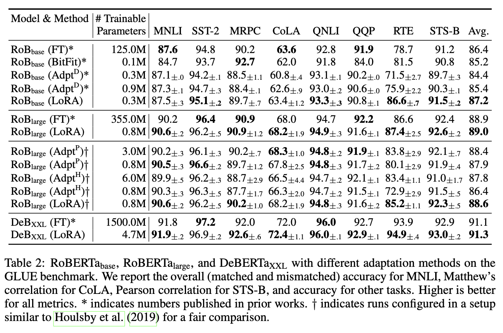

# Replication Project: LoRA Table 2
In this repo, I attempt to replicate Table 2, shown below, from the paper [LoRA: Low-Rank Adaptation of Large Language Models](https://arxiv.org/pdf/2106.09685.pdf) by Hu et al. Specifically, I attempt to recreate the results from the regular LoRA runs, not the results drawn from other papers or run under the Housby et al. setup referenced in the paper (anything without the cross or star markers).

The dataset used for this table is the GLUE benchmark dataset. I use [the version available directly through huggingface](https://huggingface.co/datasets/nyu-mll/glue) in my experiments. The hyperparameters used for each version of the project correspond to those found in Tables 9 and 10 in Appendix B of the paper.

## Results

Here are the results from my replication runs. **Due to the GPU hours needed to run many of these experiments, some results are still forthcoming. The repo will be updated as new results finish running.**

| Model | # Trainable Parameters | MNLI | SST-2 | MRPC | CoLA | QNLI | QQP | RTE | STS-B | Avg. |
| ----- | ---------------------- | ---- | ----- | ---- | ---- | ---- | --- | --- | ----- | ---- |
| RoBERTa Base | 0.3M | x | 94.5 | 86.6 | 57.7 | 92.6 | x | 71.1 | 89.0 | x |
| RoBERTa Large | 0.8M | x | x | 87.3 | 57.5 | 93.2 | x | 80.7 | 90.8* | x |
| DeBERTa XXL | 2.4M | x | x | –** | - | x | x | - | x | x |

\* Some values produced were > 5.0. These were rounded down to 5.0 to allow for evaluation.\
** Batch size reduced to 24 from 32 to allow for training on available GPUs.

## Code

There are three scripts associated with this project. Each replicates the results for a different model: `roberta_base.py`, `roberta_large.py`, and `deberta_xxl.py`. To run the different GLUE benchmark tests, adjust the code at the places marked by comments as defined by Appendix B of the LoRA paper. Each script must be connected to one CUDA-enabled GPU to run.

This code makes use of two outside resources to replicate the LoRA setup. The first is the `loralib` package, released by Hu et al. with the paper. Specifically, the code uses the `lora.Linear()` function for creating LoRA-specific linear layers, which replace the query and value attention components and the `lora.mark_only_lora_as_trainable()` method to freeze all layers not replaced by LoRA-specific ones.

## Notes

* The optimizer (AdamW) and LR schedule (linear) are not specified in the training code because they are the defaults used by the huggingface Trainer class.
* The initial paper claims that the version of `DeBERTa XXL` model with LoRA has 4.7M. However, two methods of freezing all but the query and value components (that in the attached code and that enabled by the `PEFT` library in huggingfce), both say that the LoRA version of `DeBERTa XXL` has 2.36M parameters.
* I could not figure out what was meant or how to set the CLS dropout, as specified for the `DeBERTa` experiments. Therefore the results shown here do now include that information.
* The initial results reported by the paper show the averaged results for each experiment with 5 different random seeds. Again, due to restricted GPU hours, I was not able to run each experiment 5 times.
